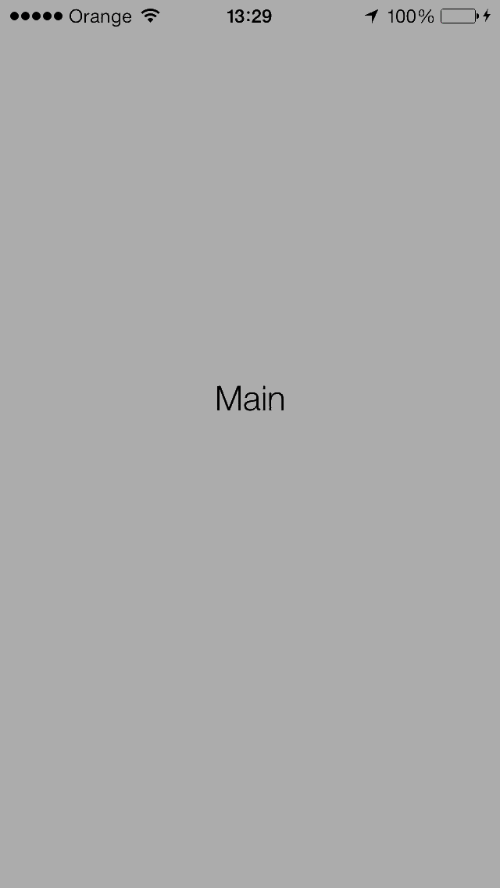

JPVerticalSlideMenu
===================

Sliding Menu for iOS (Top and Bottom menus)



With this library you can create 3 types of sliding menus: <br>
1. Slide menu with <b>top</b> menu only. <br>
2. Slide menu with <b>bottom</b> menu only. <br>
3. Slide menu with <b>both top and bottom</b> menus. <br>

## Installation

### CocoaPods

Edit Podfile and **add JPVerticalSlideMenu:**

```bash
pod 'JPVerticalSlideMenu'
```

### Manual

Clone the repository:

```bash
$ git clone https://github.com/Juanpe/JPVerticalSlideMenu.git
```

Drag and drop `JPVerticalSlideLib` folder into your project. Add `#import "JPVerticalSlideViewController.h"` to all view controllers that need to use it.

## Requirements

- iOS 7.0 or higher
- ARC

## Sample Usage


### In your AppDelegate

```objective-c
- (BOOL)application:(UIApplication *)application didFinishLaunchingWithOptions:(NSDictionary *)launchOptions
{
    self.window = [[UIWindow alloc] initWithFrame:[[UIScreen mainScreen] bounds]];

    UIViewController* vcMain        = [[UIViewController alloc] init];
    vcMain.view.backgroundColor     = [UIColor blueColor];
    
    UIViewController * vcTop        = [[UIViewController alloc] init];
    vcTop.view.backgroundColor      = [UIColor redColor];
    
    UIViewController * vcBottom     = [[UIViewController alloc] init];
    vcBottom.view.backgroundColor   = [UIColor greenColor];
    
    JPVerticalSlideViewController* verticalSlideMenu = [JPVerticalSlideViewController verticalSlideMenuWithMainVC:vcMain
                                                                                                         andTopVC:vcTop
                                                                                                      andBottomVC:vcBottom];
    
    self.window.rootViewController  = verticalSlideMenu;
    
    
    self.window.backgroundColor     = [UIColor whiteColor];
    [self.window makeKeyAndVisible];
    return YES;
}
```

## Customize

You can easily customize slide menu by overriding needed methods, such us: 
<pre>
- (CGFloat) topVCHeight;
- (CGFloat) bottomVCHeight;
- (CGFloat) panGestureWorkingAreaPercent;
</pre>

You can open or close top or bottom menus programmatically:
<pre>
- (void) openTopVC;
- (void) openTopVCAnimated:(BOOL)animated;
- (void) openBottomVC;
- (void) openBottomVCAnimated:(BOOL)animated;

- (void) closeTopVC;
- (void) closeTopVCAnimated:(BOOL)animated;
- (void) closeBottomVC;
- (void) closeBottomVCAnimated:(BOOL)animated;
</pre>

<br>
If you want to get menu's open/close callbacks, you must implement protocol named ```JPVerticalSlideVCDelegate```.
<pre>
@optional
- (void) topVCWillOpen;
- (void) topVCDidOpen;
- (void) bottomVCWillOpen;
- (void) bottomVCDidOpen;

- (void) topVCWillClose;
- (void) topVCDidClose;
- (void) bottomVCWillClose;
- (void) bottomVCDidClose;
</pre>

